

  
  <h1>LogicRs Documentation</h1>

- **[Go back to README.md](./README.md)**

## 0. Contents

- [0. Contents](#0-contents)
- [1. Application Overview](#1-application-overview)
  - [Saving and Loading Projects](#saving-and-loading-projects)
  - [Editor Controls](#editor-controls)
  - [Keyboard Shortcuts](#keyboard-shortcuts)
- [2. Builtin Modules](#2-builtin-modules)
  - [Basic Modules](#basic-modules)
  - [Input/Output Modules](#inputoutput-modules)
  - [Gate Modules](#gate-modules)
  - [Latch Modules](#latch-modules)
- [3. Custom Modules](#3-custom-modules)
  - [Creating a new module](#creating-a-new-module)
  - [Exporting Modules](#exporting-modules)

## 1. Application Overview

When you first start up LogicRs, you're greeted with an empty project file. The presented window will look something like this:

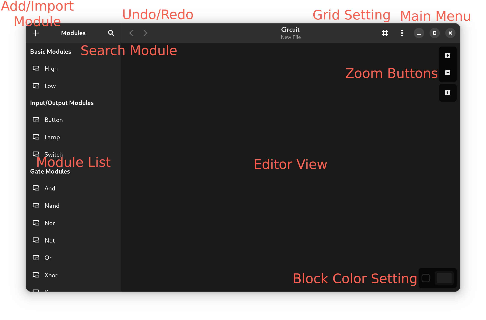

Here you can start by selecting a module from the module list on the left side and placing it in the editor area with a left click.

You can connect two blocks together by dragging from the output connection of one block to an input connection of the other block.

> **Note**
> Feel free to look into the [examples](./examples/) directory for example projects.

You can search for modules in the side bar by clicking the magnifying glass icon on the top left.

### Saving and Loading Projects

Projects can be loaded using the "Open" menu item in the main menu (top right).

Projects can be saved using `ctrl + S` or the "Save" menu item in the main menu.

The file format used for LogicRs projects is `.lrsproj`.

### Editor Controls

- `right click`: (selection) context menu
- `left click`: (un-)select or interact with a block
- `mouse drag`:
  - in empty space: select all items in an area
  - on a block: move that block
  - on a waypoint: move that waypoint
  - on an output connector: draw a new connection between two blocks
  - with `alt`: draw a new connection from a waypoint
  - with `ctrl`: move the editor view
- `mouse wheel`: zoom in or out of the editor

### Keyboard Shortcuts

- `ctrl + A`: select all items in the current editor
- `ctrl + C`: copy the current selection
- `ctrl + X`: cut the current selection
- `ctrl + V`: paste the currently copied items
- `ctrl + Z`: undo last action
- `ctrl + Y`: redo last action
- `ctrl + Q`: quit the application
- `ctrl + ,`: show about screen
- `ctrl + S`: save the current file
- `ctrl + shift + S`: save the current file as...
- `ctrl + O`: open a file
- `ctrl + N`, `ctrl + W`: create a new project
- `del`: delete the current selection
- `ctrl + shift + N`: create a new module
- `ctrl + F`: search for a module

## 2. Builtin Modules

LogicRs features several builtin modules available for every project. Here is a list of all modules built-in by default:

### Basic Modules

- **`High`**: outputs a constant `1` signal
- **`Low`**: outputs a constant `0` signal

### Input/Output Modules

- **`Button`**: momentary push-button reacting to user input
  
  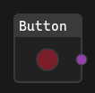

- **`Lamp`**: lights up when the input signal is `1`

  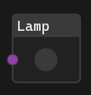

- **`Switch`**: toggle button reacting to user input
  
  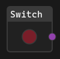

### Gate Modules

- **`And`**: outputs `1`, when all input signal are `1`:

  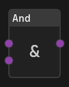

  | A | B | Output |
  |---|---|--------|
  | 0 | 0 | 0      |
  | 0 | 1 | 0      |
  | 1 | 0 | 0      |
  | 1 | 1 | 1      |

- **`Nand`**: inverse of `And`:

  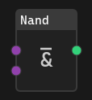

  | A | B | Output |
  |---|---|--------|
  | 0 | 0 | 1      |
  | 0 | 1 | 1      |
  | 1 | 0 | 1      |
  | 1 | 1 | 0      |

- **`Nor`**: inverse of `Or`:

  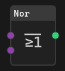

  | A | B | Output |
  |---|---|--------|
  | 0 | 0 | 1      |
  | 0 | 1 | 0      |
  | 1 | 0 | 0      |
  | 1 | 1 | 0      |

- **`Not`**: outputs the inverse of the input signal:

  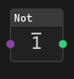

  | Input | Output |
  |-------|--------|
  | 0     | 1      |
  | 1     | 0      |

- **`Or`**: outputs `1` if either A or B or both inputs are `1`:

  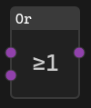

  | A | B | Output |
  |---|---|--------|
  | 0 | 0 | 0      |
  | 0 | 1 | 1      |
  | 1 | 0 | 1      |
  | 1 | 1 | 1      |

- **`Xnor`**: inverse of `Xor`:

  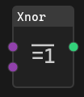

  | A | B | Output |
  |---|---|--------|
  | 0 | 0 | 1      |
  | 0 | 1 | 0      |
  | 1 | 0 | 0      |
  | 1 | 1 | 1      |

- **`Xor`**: outputs `1` if either the A *or* (strictly) B input is `1`:

  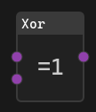

  | A | B | Output |
  |---|---|--------|
  | 0 | 0 | 0      |
  | 0 | 1 | 1      |
  | 1 | 0 | 1      |
  | 1 | 1 | 0      |

### Combinational Modules

- **`Mux`**: A 2:1 multiplexer, selecting either the A or B input based on the S input:

  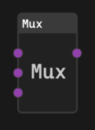

  | S | Output |
  |---|--------|
  | 0 | A      |
  | 1 | B      |

- **`Demux`**: A 1:2 demultiplexer, selecting either the O0 or O1 output based on the S input:
  
  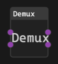

  | S | O1 | O0 |
  |---|----|----|
  | 0 | 0  | A  |
  | 1 | A  | 0  |

### Latch Modules

- **`JK Latch`**: Latch similar to the `SR Latch`, but toggeling its value when both inputs A and B are `1`:

  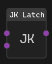

  | A | B | Action    |
  |---|---|-----------|
  | 0 | 0 | No change |
  | 0 | 1 | Reset     |
  | 1 | 0 | Set       |
  | 1 | 1 | Toggle    |

- **`SR Latch`**: Latch used to store a value:

  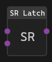

  | A | B | Action      |
  |---|---|-------------|
  | 0 | 0 | No change   |
  | 0 | 1 | Reset       |
  | 1 | 0 | Set         |
  | 1 | 1 | Not allowed |

- **`SR Nand Latch`**: 

  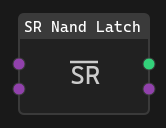

  | A | B | Action      |
  |---|---|-------------|
  | 0 | 0 | Not allowed |
  | 0 | 1 | Store 1     |
  | 1 | 0 | Store 0     |
  | 1 | 1 | No change   |

> **Note**
> Feel free to submit pull-requests for more module implementations

## 3. Custom Modules

LogicRs allows you to create your own blocks implementing other and more complex behavior.

Custom modules can either be newly created using the `New Module` dialog or imported from an external `.lrsmod` file.

### Creating a new module

When you create a new module, you'll be shown this popup:

Here, you can select the name of the module, the number of input and output connections.

> **Warning**
> These settings cannot be changed afterwards currently!

After selecting "Ok", a new tab will appear with the module's contents:

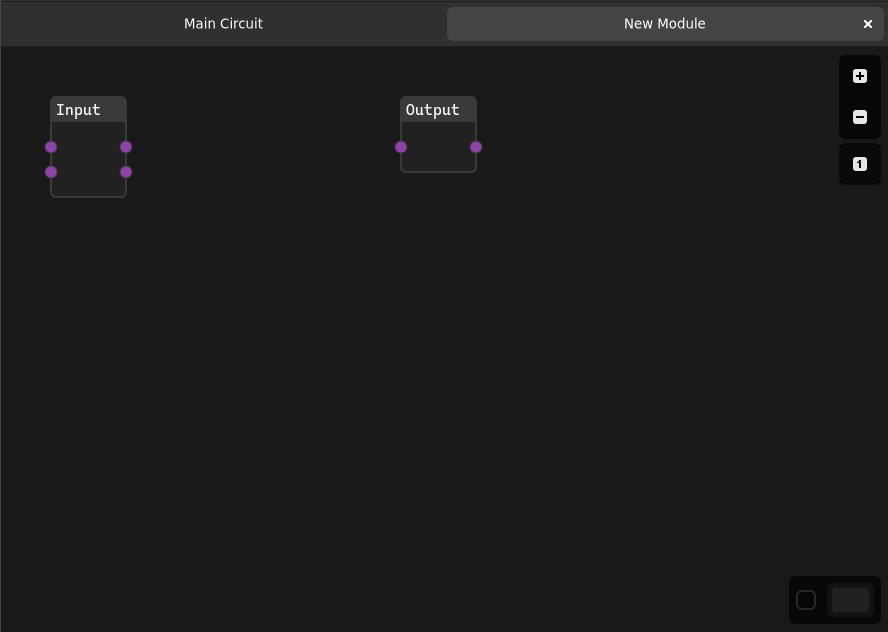

> **Note**
> If you closed this tab, you can re-open it by selecting "Edit Contents" from the module's context menu in the side bar.

You see two blocks already put in by default: These are the input/output blocks which receive and return values. They are double-sided and act like passthroughs to allow in-place debugging/testing of a single module. You cannot delete these blocks.

Between the two blocks, you can implement your own logic using the built-in blocks or other custom blocks.

> **Note**
> Keep in mind, that recursive modules (i.e. Modules that depend on themselves) will not work and will cause the simulator to stop working until resolved.

### Exporting Modules

To export a module, simply right-click on the respective module in the side-bar and select the "Export" menu item. You can then select an appropriate file name for your module.

Modules are stored using the `.lrsmod` file extension.

-----------------------------------------
- **[Go back to README.md](./README.md)**