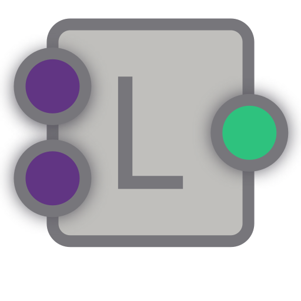
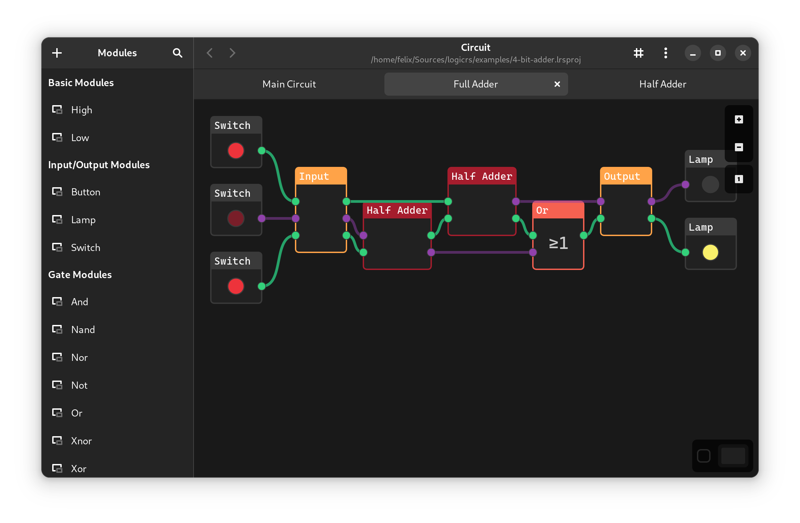

<h1>LogicRs</h1>

[📑 Documentation](./DOCS.md) |
[💾 Installation](./INSTALL.md) |
[🤝 Contributing](./CONTRIBUTING.md) |
[📜 License](./LICENSE)

**LogicRs** is an easy-to-use, free and open-source simulator for logical circuits/diagrams written in rust.

This program is meant for students, who want learn about [boolean algebra](https://en.wikipedia.org/wiki/Boolean_algebra) and visualize their equations as well as for developers simulating and debugging conditional expressions found everywhere in programming.

## Installation

LogicRs can be downloaded as a prebuilt package from the [releases](https://github.com/Spydr06/logicrs/releases) tab in the following formats:

- `.AppImage` package (Linux)
- `.zip` portable installation (Windows)

Alternatively, you can download this repository and build LogicRs from source. 
Please refer to [INSTALL.md](./INSTALL.md) for build instructions and information about compatability

## Documentation

Documentation can be found in the [DOCS.md](./DOCS.md) file.

## Examples

Examples demonstrating this program can be found in the `examples/` directory.

## Contributing

Pull requests are welcome. For major changes, please open an issue first to discuss what you would like to change.

**View [CONTRIBUTING.md](./CONTRIBUTING.md) for more information**

## License
LogicRs is licensed under the [MIT License](https://mit-license.org/)
